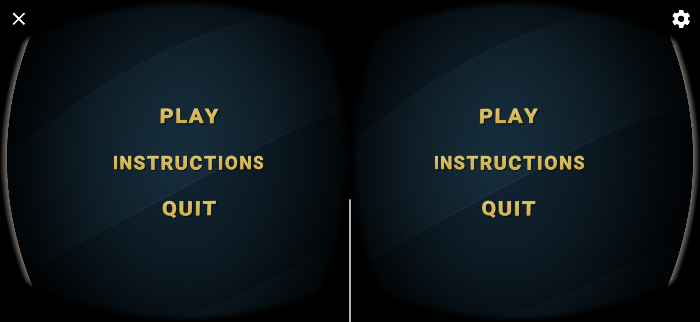
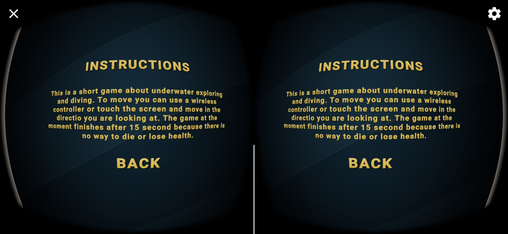
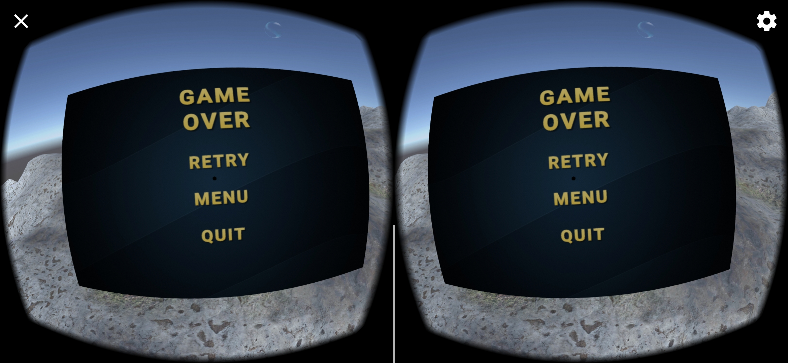
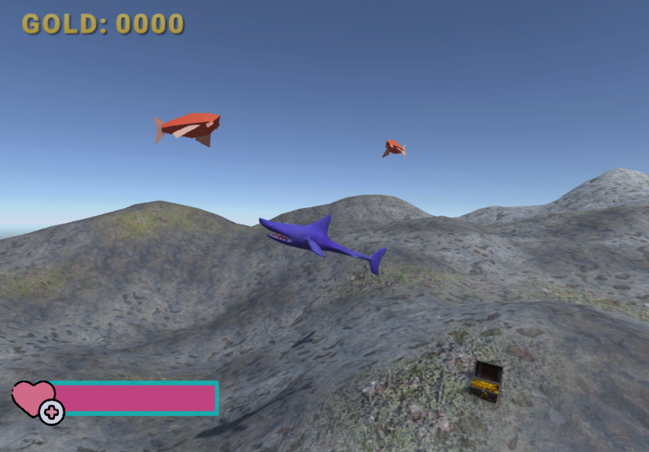

# Aquarium

## Part 1 - Seting the environment

Aquarium is a small underwater exploration game. The game as well as the experience of building it is and exploration. I am figuring out Unity as well as playing with Virtual reality for the first time. The game is based under the sea surface and you can look around and explore. This is intended to be a small Android game for the [Google Cardboard](https://arvr.google.com/cardboard/) platform. I use the Google VR SDK for Unity for the camera projections and gyroscopic inputs. This is a very early version and the only things I have done up until now is the camera and whole VR SDK setup and the building environment. I also created some crude terain and textured it, along with some post processing which is suppose to look like you are under water. I experimented with Unity's particle system to create bubbles and imported some fish assets to enrich the experience. Below is a short preview of the current version of the current version. The app can be installed by downloading and installing the `.apk` file [here](project_assets/project.apk). To install the app you must allow installs outside of the google play store in your phone settings.

## Part 2 - Movement

In this part I was tasked with implementing the movement in the game. I am going for an underwater sort of floating movement. So I decided the best way is to not restrict the player to moving only on the terrain surrface but also up above (as if swimming underwater). I achieved this by applying a force in the direction of the front vector for the main player camera. The movement was rather simple however getting user input was the challenging part. Since I do not own a game pad, I resorted to a mobile app that emulates a gamepad on another phone and is connected to the phone running the game via bluetooth. I used the [Gamepad VR](https://play.google.com/store/apps/details?id=com.kunkunsoft.gamepadforvr&hl=en_US&gl=US) app for the gamepad emulation. This alloved me to controll the player in the game. A short demo of the movement in action can be seen [here](https://drive.google.com/file/d/1Sc6ewQEjzIUuawLsqnPdKuepgZswlBLV/view).

## Part 3 - UI and Menus

This part of the project had an objective to create some simple menu UI elements for the game. I created a main menu, pause menu and game over menu for the app. I feel that these menus are essential for user interaction since there needs to be a way to start, pause and end the game. In the main menu I added 3 options:

 * Play -> Starts the game and lets the player interact with the environment
 * Instructions -> A shor description for the game
 * Quit -> Quits the application

 The pause menu is activated by and X button in the top left corner because I do not own a wireless controller for now. This menu has 2 options:

 * Resume -> Resumes the game
 * Menu -> Returns the player to the main menu

 The final menu is the Game Over menu. This menu has 3 options as well:

 * Retry -> Restarts the game
 * Menu -> Returns the player to the main menu
 * Quir -> Quits the application

The UI was built on a **Canvas** on the UI layer. The Canvas GameObject is rendered in World space so it can be interacted with by the player. I make sure to transform the Canvas plain to be orthogonal to the forwar vector of the main camera so that the user i always facing the menu when it is first displayed. Each of the Text and Button elements are constructed using elements from the **Text Mesh Pro** package wich is supported by Unity. 

In the current version of the game there is no way for the game to finish (the player to lose health and die) so I have set up a count-down timer of 15s and when it is elapsed, the Game Over Menu is displayed (signaling that the game is over). 

A video of the menus can be seen [here](https://drive.google.com/file/d/1_hkHsyci088lF7Y9l_mxywVT7s5JX8Ob/view?usp=sharing). 

## Part 4 - Interactions

In this part I am implementing player intereactions. Here the player starts to interact in simple ways with his virtual environment. The main interactions I wanted to implement were:

* Interactions with Enemies (attack/demage)
* Interactions with loot (a sort of scoring system)
* Interactions with healing statios (to replenish lost health)

For this I first needed to implement the enemies and their AI. As it stands the current enemy script is focused on following the player by transforming their position in the direction of the player if he is in their look-out range. When they catch up to the player and close the distance, the player will enter their attack range. This is when an attack method is called and the enemy deals some ammount of demage to the player. The attack is reset after a period of time and the enemy can attack again if the player is in it's attack range. The attack demage, attack cooldown, attack range, look-out range and speed of enemise are all configurable through variables in the script (and in the Unity editor). I have attatched the enemy script to a shark model that acts as the enemy of the game.

In order for the player to take demage, a health system was required. I wrote a shor health script that adjusts a current health based on a max health value. These values are configurable, but the current health is set to the max health when the player spawns. With this in mind, the player can take demage and reduce their current health or heal and increase it. The health is clamped between 0 and the max health value so that it doesn't overflow. When the current health reaches 0, the player "dies" and the game over screen is shown.

In order to heal I added halth packs that are scatered across the map. When a player gets close to the health pack the pack is collected, the player is healed (current healt is increased) and the health pack entity is destroyed. The range where the player can pick up the health pack is configurable as well as the ammount of healing the pack provides. I have attatched the health pack script to a fish model which the player can collect and be healed.

To track the health a designed a healthbar which is composed of two rectangles where one is the background and the other the fill of a slider. The width of the fill rectangle represents the current health of the player relative to the max health value. To make it look better I added a hear image so it is more intuitive what the bar represents. I also added a score counter that can be seen below in the image as the "GOLD:" ammount. This is a way for the player to keep track of his score. All of this is added to a canvas that represents the player's Heads Up Display (HUD). The canvas is rendered in World Space and is a child of the main camera (the player) so it is always rendered in front of the player.

The mentioned score counter comes into play with the implementation of the scoring interaction. Through the level I have scattered treasure chests with gold. When a player gets close to the chest, in it's collection radius, the gold is collected and the chest is left empty. This generates score od "GOLD" points for the player. To keep track of the score and update the score counter I implemented a score script whic is attatched to the score counter. This is also referenced by the player and the score is updated when it needs to be.

With this I have implemented 3 types of interactions that the player can currently perform. Haling, Scoring and Being Attacked. In future versions I am planing to improve these interactins as well as add variations. I would also like to add a way for the player to attack enemies and "kill" them for self defense.

A video of all of this in action can be found [here](https://drive.google.com/file/d/1MFvYEwKKsc76f9Xx3xXjjUJEPeRByu2i/view?usp=sharing) and [here](https://drive.google.com/file/d/1k3bEtu9hO98XrJgvYJzrCCpKG-nTHwTt/view?usp=sharing). Note that these videos vere taken after the sound was implemented so there are soundefects present.

## Part 5 - Music and Sound effects

After adding interactions to the game it feels very empty without sound so that's why that is next on the list. This was a simple implementation since all the trigers were already implemented in the last part with the interactions. So I only needed to load and play the sound clips. For the sound effects I downloaded royalty free sounds from the internet for free. After loading them in the editor I opted to implement an audio manager that would load the audio and add the audio sources so that I can play the clips from anywhere. For this I first implemented a Sound class that would hold setting and information about the sound clip such as the name, volume, pitch and the sound clip itself. Then I implemented an AudioManager script that manages these sounds. It contains an array of sounds. At the creation of the audio manager, for each of these sounds in the sounds array, an audio source is created. This allows me to search for a sound based on it's name and play it from the sound and play it from anywhere in my code.

After the audio was set up, I started adding the sounds I downloaded and then placing them in the code where they should be triggered. Currently I have implemented sound effects for colecting loot, being attacked and healing. Also when the player "dies" and the game is over a sound is playd indicating this. As well as this I also added a background track that plays and loops in the whole game (as well as the menus). The track is started when the audio manager is created (which is a slingleton).

A video of all of this in action can be found [here](https://drive.google.com/file/d/1MFvYEwKKsc76f9Xx3xXjjUJEPeRByu2i/view?usp=sharing) and [here](https://drive.google.com/file/d/1k3bEtu9hO98XrJgvYJzrCCpKG-nTHwTt/view?usp=sharing). These are the videos from the previous part since they were recorded after the audio was added.