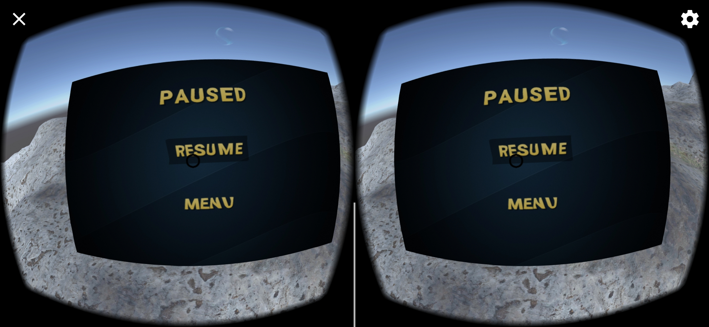

# Aquarium

## Part 1 - Seting the environment

Aquarium is a small underwater exploration game. The game as well as the experience of building it is and exploration. I am figuring out Unity as well as playing with Virtual reality for the first time. The game is based under the sea surface and you can look around and explore. This is intended to be a small Android game for the [Google Cardboard](https://arvr.google.com/cardboard/) platform. I use the Google VR SDK for Unity for the camera projections and gyroscopic inputs. This is a very early version and the only things I have done up until now is the camera and whole VR SDK setup and the building environment. I also created some crude terain and textured it, along with some post processing which is suppose to look like you are under water. I experimented with Unity's particle system to create bubbles and imported some fish assets to enrich the experience. Below is a short preview of the current version of the current version. The app can be installed by downloading and installing the `.apk` file [here](project_assets/project.apk). To install the app you must allow installs outside of the google play store in your phone settings.

## Part 2 - Movement

In this part I was tasked with implementing the movement in the game. I am going for an underwater sort of floating movement. So I decided the best way is to not restrict the player to moving only on the terrain surrface but also up above (as if swimming underwater). I achieved this by applying a force in the direction of the front vector for the main player camera. The movement was rather simple however getting user input was the challenging part. Since I do not own a game pad, I resorted to a mobile app that emulates a gamepad on another phone and is connected to the phone running the game via bluetooth. I used the [Gamepad VR](https://play.google.com/store/apps/details?id=com.kunkunsoft.gamepadforvr&hl=en_US&gl=US) app for the gamepad emulation. This alloved me to controll the player in the game. A short demo of the movement in action can be seen [here](https://drive.google.com/file/d/1Sc6ewQEjzIUuawLsqnPdKuepgZswlBLV/view).

## Part 3 - UI and Menus

This part of the project had an objective to create some simple menu UI elements for the game. I created a main menu, pause menu and game over menu for the app. I feel that these menus are essential for user interaction since there needs to be a way to start, pause and end the game. In the main menu I added 3 options:

 * Play -> Starts the game and lets the player interact with the environment
 * Instructions -> A shor description for the game
 * Quit -> Quits the application

 The pause menu is activated by and X button in the top left corner because I do not own a wireless controller for now. This menu has 2 options:

 * Resume -> Resumes the game
 * Menu -> Returns the player to the main menu

 The final menu is the Game Over menu. This menu has 3 options as well:

 * Retry -> Restarts the game
 * Menu -> Returns the player to the main menu
 * Quir -> Quits the application

The UI was built on a **Canvas** on the UI layer. The Canvas GameObject is rendered in World space so it can be interacted with by the player. I make sure to transform the Canvas plain to be orthogonal to the forwar vector of the main camera so that the user i always facing the menu when it is first displayed. Each of the Text and Button elements are constructed using elements from the **Text Mesh Pro** package wich is supported by Unity. 

In the current version of the game there is no way for the game to finish (the player to lose health and die) so I have set up a count-down timer of 15s and when it is elapsed, the Game Over Menu is displayed (signaling that the game is over). 

A video of the menus can be seen [here](https://drive.google.com/file/d/1_hkHsyci088lF7Y9l_mxywVT7s5JX8Ob/view?usp=sharing). 

